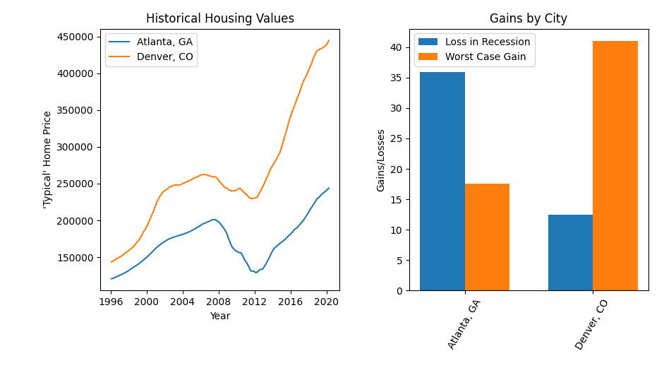

# ZillowVisualizer
A simple script for visualizing the housing data csv's published by Zillow.
Download Zillow data from [here](https://www.zillow.com/research/data/).
Then, update the script to reflect the file name of your download and the cities you wish to plot.

Data will be plotted like so:
